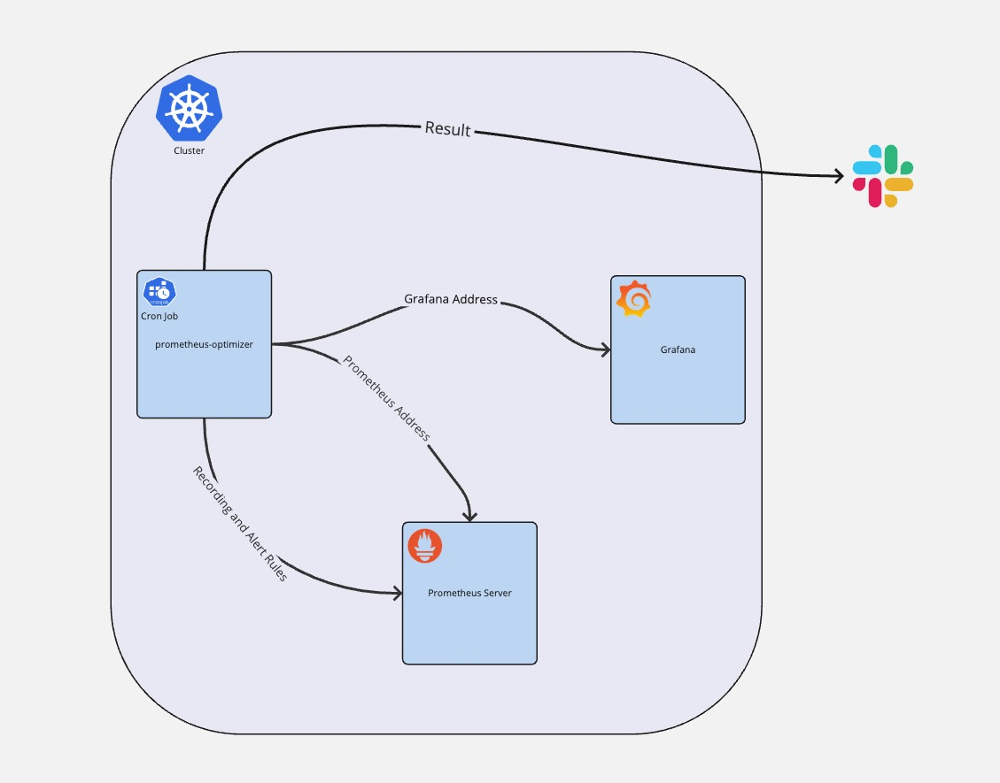

# Prometheus Optimizer


[](https://artifacthub.io/packages/search?repo=prometheus-optimizer)

## Overview
Prometheus Optimizer enhances Prometheus monitoring by optimizing configuration and rules management. It aims to improve performance and manageability for large-scale Prometheus deployments.Prometheus Optimizer actively analyzes Prometheus configurations, including recording rules, alert rules, and Grafana dashboards. It identifies metrics that are unused or redundant, generating a tailored Prometheus configuration to drop these metrics effectively. The tool automates the process of identifying inefficiencies in metric collection, allowing you to focus on truly valuable data, reducing storage and processing overhead.



## Features
- **Optimization**: Dynamically optimizes Prometheus based on usage and metrics.
- **Scalability**: Designed to handle large-scale Prometheus installations.

## Getting Started
### Prerequisites
- Kubernetes cluster with Helm installed.
- Prometheus setup within the cluster.
- Access to a Grafana instance with a service account token for read-only access.
- Slack bot with `files:write` permission for report integration.

### Installation
To install Prometheus Optimizer, add the Helm repository and deploy the chart to your Kubernetes cluster:
```bash
helm repo add prometheus-optimizer https://angelscloud.github.io/prometheus-optimizer/
helm install prometheus-optimizer prometheus-optimizer/prometheus-optimizer
```

#### Integrating Slack for Reports
To receive optimization reports directly in your Slack channel:

- Create a Slack App and enable incoming webhooks.
- Add files:write permission to allow file uploads.
- Configure the webhook URL in your values.yaml.

#### Setting Up Grafana Service Accounts
Ensure each Grafana organization has a service account with at least Viewer access:

- Log into Grafana and navigate to Administration > Users and access >  Service Accounts.
- Create a new Token with Viewer permissions.
- Specify the service account token in your values.yaml for each Grafana organization.

### Configuration
 Customize your deployments by modifying the values.yaml file to fit your specific monitoring requirements.

### Usage
Once deployed, Prometheus Optimizer will begin to analyze Prometheus configurations, including recording rules, alert rules, and Grafana dashboards. Detailed reports on potential optimizations are provided, simplifying the process of enhancing your monitoring setup.

## Contributing
Contributions are what make the open-source community such an amazing place to learn, inspire, and create. Any contributions you make are greatly appreciated.

## License
This project is licensed under the MIT License - see the LICENSE file for details.

## Contact
angelscloud

**Project Link:** https://github.com/angelscloud/prometheus-optimizer

## Acknowledgements
- **Prometheus**
- **Helm** 
- **Kubernetes**

## Explanation:
- **Overview**: Briefly describes what the project is about.
- **Features**: Highlights the key functionalities of the project.
- **Getting Started**: Provides installation instructions and how to get the project running.
- **Configuration**: Describes how to configure the project.
- **Contributing**: Encourages others to contribute to the project.
- **License**: Notes the project's license.
- **Contact**: Provides a method for others to reach out or contribute.
- **Acknowledgements**: Credits to tools or libraries used.
